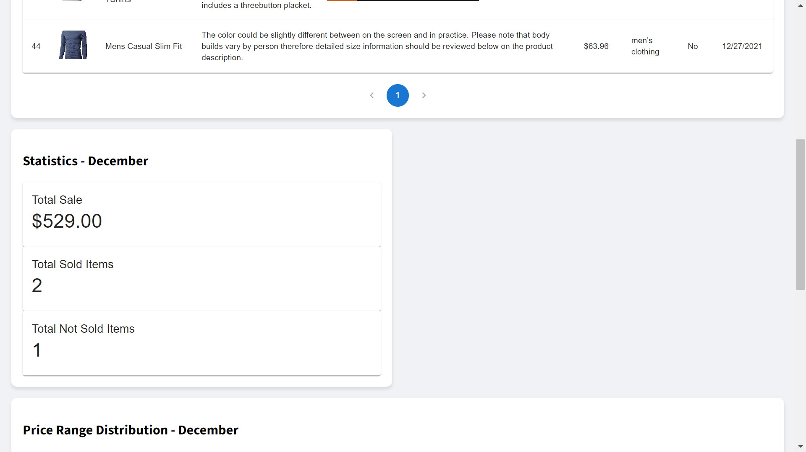

# Project Name

Project fetches a data of transactions from a API and analyze, calcualte and visualize it in a presentational format. It includes tabular representation of all transactions that are made, statistics for monthly sales, bar chart for price range analysis, pie chart for category analysis. We can filter the data for specific month and also search through the tabular data.

## Table of Contents
- [Screenshots](#screenshots)
- [Technologies Used](#technologies-used)
- [Features](#features)
- [Installation](#installation)
- [Usage](#usage)
- [API Documentation](#api-documentation)
- [Contributing](#contributing)
- [License](#license)

## Screenshots


*Transaction Table*


*Statistics for monthly sales*


*Bar Chart for Price range Analysis*


*Pie Chart for Category Analysis*

## Technologies Used

- Frontend:
  - React.js
- Backend:
  - Node.js
  - Express.js
- Database:
  - MongoDB
- Other:
  - Axios, Material UI, Charts.js, RE Charts

## Features

- Tabular Representation of transaction data
- Calculated Statistics 
- Barchart for Price Range Evaluation
- Piechart for Categories Evaluation

## Installation

1. Clone the repository:

```shell
git clone https://github.com/AMN-SHK/Roxiller-Task.git
```

2. Navigate to the project directory:

```shell
cd Roxiller Task
```

3. Install backend dependencies:

```shell
cd backend
npm install
```

4. Install frontend dependencies:

```shell
cd ../frontend
npm install
```

## Usage

### Running the Backend

1. Navigate to the backend directory:

```shell
cd backend
```

2. Create a `.env` file in the backend directory and add necessary environment variables:

```shell
PORT=5000
MONGO_URI=your_MongoDB_connection_URI
THIRD_PARTY_API_URL=https://s3.amazonaws.com/roxiler.com/product_transaction.json
```

3. Start the backend server:

```shell
npm start
```

The backend should now be running on `http://localhost:5000`

### Running the Frontend

1. Open a new terminal and navigate to the frontend directory:

```shell
cd frontend
```

2. Start the frontend development server:

```shell
npm start
```

The frontend should now be accessible at `http://localhost:3000` 

## API Documentation

- GET `/api/initialize-db`: Initializes the database
- GET `/api/transactions`: Fetches all transactions (Query parameters: month = numerical value for month '03' for March, search = String value in description or title, page = page number in pagination, perPage = numerical value of how many transactions to be displayed per page)
- GET `/api/statistics`: Fetches all transactions (Query parameters: month = numerical value for month '03' for March)
- GET `/api/bar-chart`: Fetches bar chart data for price evaluation (Query parameters* : month = numerical value for month '03' for March)
- GET `/api/pie-chart`: Fetches pie chart data for category evaluation (Query parameters* : month = numerical value for month '03' for March)
- GET `/api/combined-data`: Fetches combined data for statistics, bar chart and pie chart (Query parameters* : month = numerical value for month '03' for March)

## Contributing

No Need for contibutions as this is a corporate task

## License

ISC